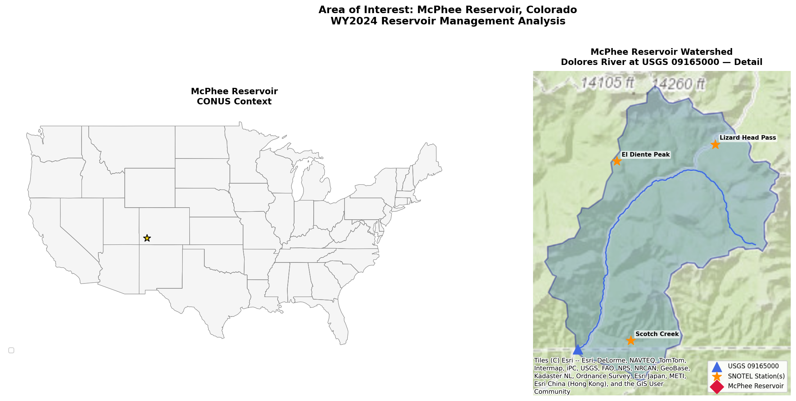

# HW2 – McPhee Reservoir Management Analysis

This repository contains a Python-based hydroinformatics analysis of **McPhee Reservoir** on the Dolores River in southwestern Colorado. The analysis integrates April 1 Snow Water Equivalent (SWE) observations from SNOTEL stations in the Dolores River watershed with historical USGS streamflow records to characterize seasonal water availability and inform reservoir operations. Watershed delineation is performed programmatically via the USGS NLDI, and elevation data are retrieved from 3DEP. All data acquisition, processing, and figures are generated automatically with no user input required.

The repository includes a single self-contained script (`HW2_Reservoir_Management.py`) that covers five analysis sections: (1) Area of Interest and watershed mapping, (2) SWE climatology and current-year snowpack conditions, (3) USGS streamflow analysis, (4) peak SWE vs. monthly streamflow volume regression, and (5) operator recommendations based on a linear regression forecast of April–September runoff volume from April 1 SWE. Running the script creates all necessary output folders (`files/`, `figures/`) and caches downloaded data locally so subsequent runs do not require re-downloading.

Reproducibility note: the analysis is self-contained within this repository and does not require code from sibling folders or external local paths. A network connection is required on the first run to download source datasets (NRCS SNOTEL, USGS NWIS/NLDI, and 3DEP), after which cached files in `files/` support repeat runs.



## How to Run

```bash
conda env create -f environment.yml
conda activate hw2-reservoir
python HW2_Reservoir_Management.py
```
